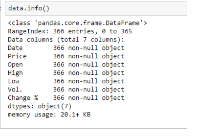
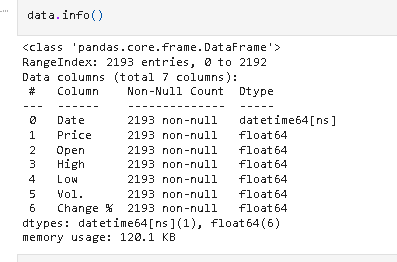
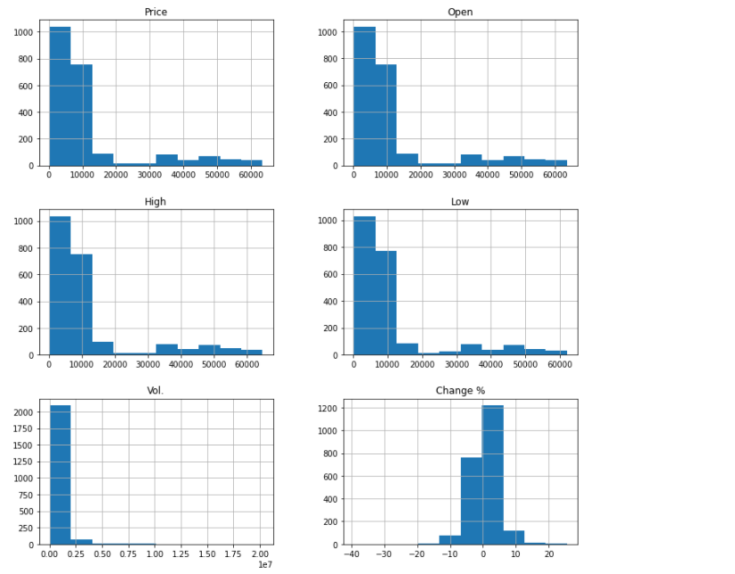
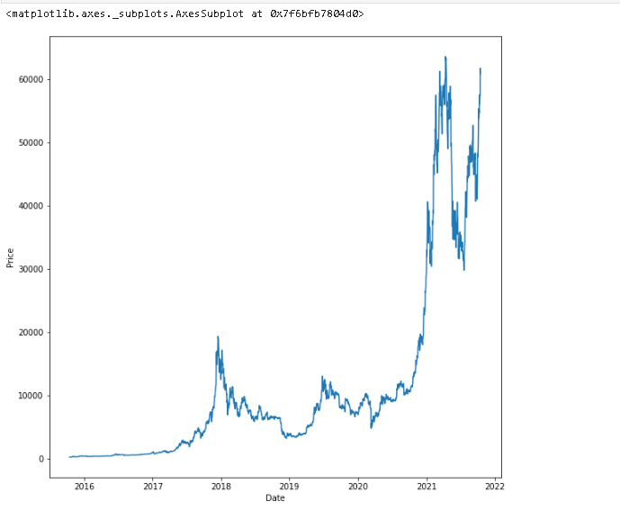
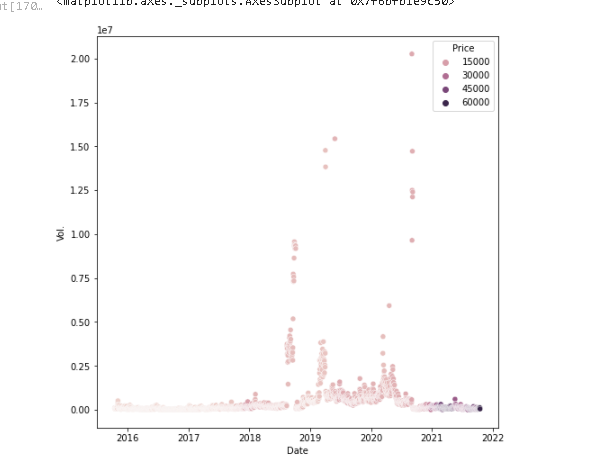
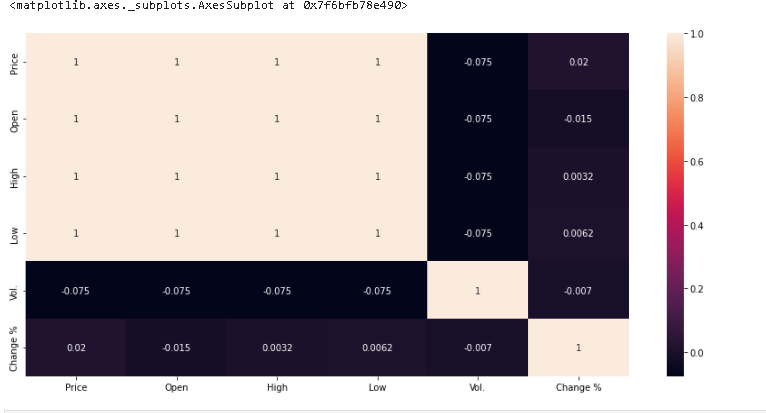
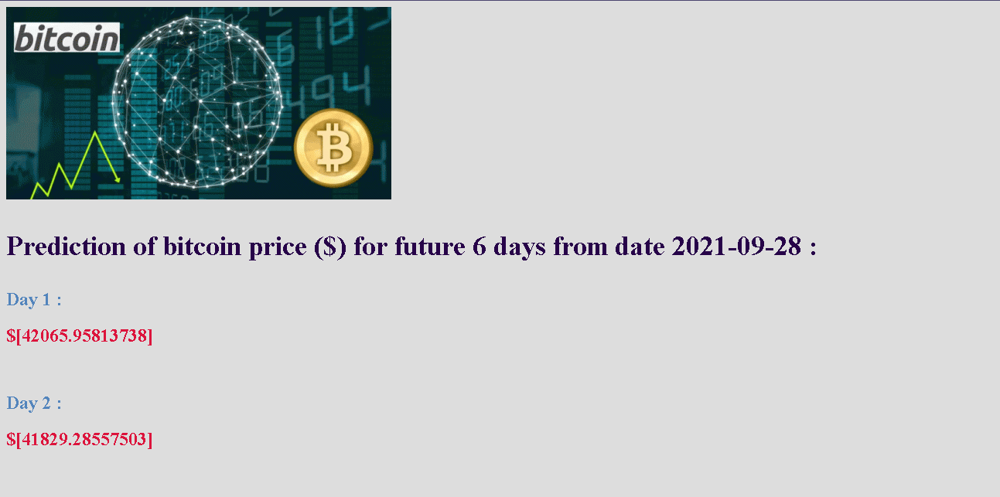
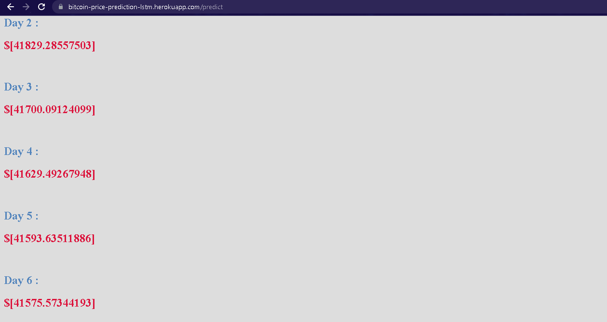

# Bitcoin Price Prediction

### INTRODUCTION

The topic of cryptocurrencies has become extremely popular recently, and as cryptocurrencies have become more popular in the mainstream, some of their prices have greatly increased as well. The most popular cryptocurrency is Bitcoin, which has risen by over 300% in the 6 months from  2020 to  2021. One of the problems with Bitcoin and other cryptocurrencies is the high amount of volatility in their pricing, meaning that price can fluctuate significantly over a small period of time. While this is an issue when it comes to investing long-term in cryptocurrency, this also means that creating an algorithmic trading strategy for cryptocurrencies would be an interesting, and possibly profitable, problem to work on. In this project, we decided to focus purely on Bitcoin, as it was the cryptocurrency with the most data and the highest volume of trading.
This website gave us future bitcoin price for X future days.
## DATASET AND FEATURES

We scraped data for historical bitcoin prices for each day from date oct-16 2015 to oct-16 2021 ,which nearly equals to 2000 data points. This data is taken from investing.com website.
Using this data, we created neural network model. The input to our algorithms is  price data of bitcoin.

### Features
• Date
 
• High: High price of day

• Low: Low price of day

• open: open price of day

• Vol: Volume of bitcoin traded in a day

• Price: actual price for a day

• Change% : change in bitcoin price(negative orpositive)

## Exploratory Data Analysis

1)First we get acquainted with Data, we found out that every feature is in object format.

so we converted the following features  to float datatype and Date to datetime datatype.

2)Also, we changed volume by removing K and multiplying it by 1000.

3)We find out if any null values are present in the dataset.There were no null values.

4)We plotted Boxplot to see if any outliers are present or not.in our datasset amount of outler present were too less so we ignored that.

5)We plotted number of graphs:
  * #### Histograms  :
        * Which showed the distributions of all the features pressent.
        
      
        
  * #### Line plots :
      * Between Date and Price :
         It showed that price increases linearly as date increases.
         

  * #### Scatter plot :
    * Between Date  Volume and hue as price which showed how volume varied non linearly with price.
    
    
  * #### HeatMap :
     This showed how each and every feature of our dataset varied with each other.
     Price with other features like open high, low as positive correlation and with volume it correlated negatively.
     
     
## Splitting Dataset

Firstly we scaled our entire Dataset using MinMax Scaling in the range 0,1.

As we are working on Timeseries Data, we cant split our data randomly.a sequential manner must be followed.
So first 75% data is taken as Training data and rest as testing data.
## Creating Input Arrays for Model

our main aim is to predict  price of bitcoin for the next day on the basis of previous 15 days price.

So ,it is clear that we are dealing only with the price column.
For grouping price into 15 values , such that for each group of 15 days price values (this will be added to X_train ), immediate next day price value will be predicted (this price will be added to Y_train). 
Similar grouping is done for test dataset.

After this reshaping of train and test data set is done to convert it into 3d array.

## Modelling
### LSTM

Long Short-Term Memory (LSTM) networks are a type of recurrent neural network capable of learning order dependence in sequence prediction problems.

This is a behavior required in complex problem domains like machine translation, speech recognition, and more.

The first part chooses whether the information coming from the previous timestamp is to be remembered or is irrelevant and can be forgotten. In the second part, the cell tries to learn new information from the input to this cell. At last, in the third part, the cell passes the updated information from the current timestamp to the next timestamp.

These three parts of an LSTM cell are known as gates. The first part is called Forget gate, the second part is known as the Input gate and the last one is the Output gate.
Just like a simple RNN, an LSTM also has a hidden state where H(t-1) represents the hidden state of the previous timestamp and Ht is the hidden state of the current timestamp. In addition to that LSTM also have a cell state represented by C(t-1) and C(t) for previous and current timestamp respectively.

In our LSTM NN model , we have used 4 layers. 

Summary of model is given below :

## Accuracy
After predicting the output for test dataset.
we calculated R-score which resulted in 95.34%

## Predicting Output for future X days

For this we have written a logic such that it predicts  next day  output based on previous 15 days whose values are known to us , now adds this predicted price value in the list of previous 15 days , excludes the first price value from list and the newly predicted value will count as 15th day price value , which then will be used to predict the future next day value.

In such a way we can predict output for future X days.

## Deployment

We have used Flask framework to create a webapp .
The input taken from the user will be :
* Date of price prediction((In this project , we have kept the date values limited to our dataset only)
* No of future days for which price is to be predicted(In this project limited to 15 days)

link to  application after deploying on heroku :https://bitcoin-price-prediction-lstm.herokuapp.com/

After succesfully  creating the webapp we have deployed our project using Heroku.

## Conclusion and FutureWork

Our Model has significantly performed well on train as well as test data set.Also after predictions of price ,we have crosschecked the valuess which came out to be nearly same.
So concluding that Model is properly trained and tested.

Further, Our next step will be to work with API , so that we can use live dates and predict values of bitcoin price for upcoming days.
